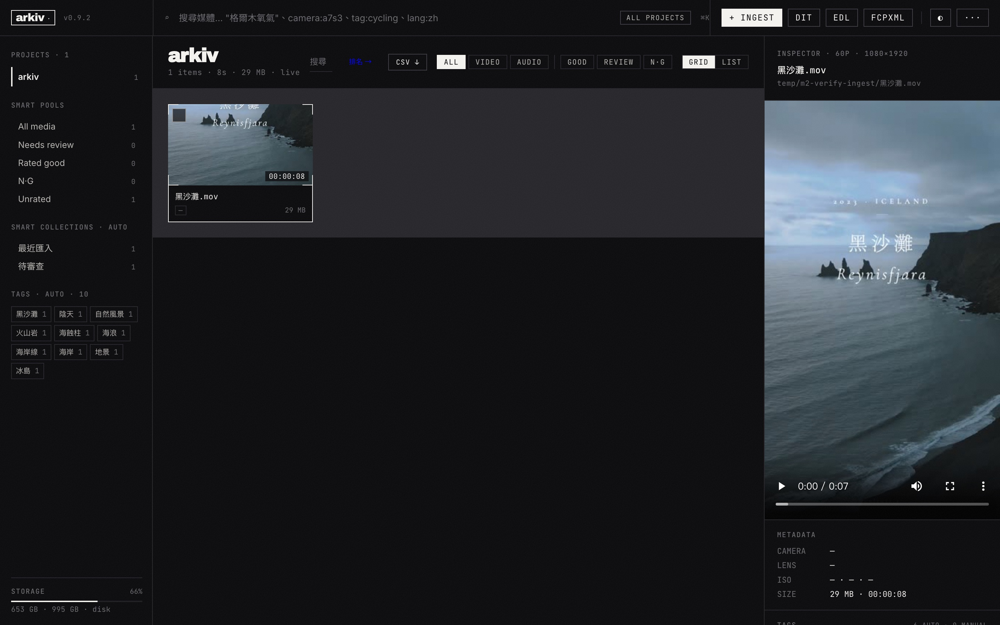

# arkiv

[](LICENSE)
[](https://python.org)
[](https://tauri.app)

**Local-first media asset manager with semantic search.**

Search, browse, rate, and tag your video/audio assets using AI-powered transcription and vector search. DaVinci Resolve-inspired dark UI.

---

## Architecture

```
┌─────────────┐    ┌──────────────┐    ┌─────────────┐
│  index.html │◄──►│  server.py   │◄──►│   db.py      │
│  (Tailwind) │    │  (FastAPI)   │    │  (SQLite)    │
└─────────────┘    └──────┬───────┘    └─────────────┘
                          │
                   ┌──────┴───────┐
                   │  embed.py    │◄──► ChromaDB
                   │  (Ollama)    │     (nomic-embed-text)
                   └──────────────┘
                          
      ┌───────────┐ ┌─────────┐ ┌─────────────┐ ┌──────────┐
      │ ingest.py │ │frames.py│ │transcribe.py│ │ vision.py│
      │ (FFmpeg)  │ │(scenes) │ │  (Whisper)  │ │ (llava)  │
      └───────────┘ └─────────┘ └─────────────┘ └──────────┘
```

## Screenshots



## Features

- **Semantic search** — query in natural language (Chinese/English/Japanese)
- **AI transcription** — Whisper large-v3 (Apple Silicon MLX / NVIDIA CUDA / CPU)
- **Frame analysis** — llava:7b scene descriptions
- **Rating system** — GOOD / NG / Review with notes
- **Tag system** — auto (AI) + manual tags with autocomplete
- **DaVinci Resolve UI** — dark theme, 3-panel layout, filmstrip, waveform
- **Export** — SRT, VTT, TXT, EDL subtitle/edit formats
- **Tauri native app** — desktop app with native file/folder dialogs
- **DaVinci Resolve plugin** — search and import directly from Resolve

## Quick Start

### Prerequisites
- Python 3.9+
- FFmpeg 6.0+
- Ollama with `nomic-embed-text` model

### Install

```bash
git clone https://github.com/vulture-s/arkiv.git
cd arkiv
python -m venv .venv
source .venv/bin/activate        # macOS / Linux
# .venv\Scripts\activate         # Windows (PowerShell)
pip install -r requirements.txt

# Install Whisper backend (pick one):
pip install mlx-whisper          # macOS Apple Silicon
pip install faster-whisper torch  # NVIDIA GPU
pip install faster-whisper        # CPU fallback

# Pull Ollama models
ollama pull nomic-embed-text
ollama pull llava:7b  # optional, for frame descriptions

# Check environment
python health.py
```

### Option A: Web UI — browse, search, rate, and tag in the browser

```bash
# macOS / Linux
uvicorn server:app --host 0.0.0.0 --port 8501

# Windows (PowerShell) — UTF-8 required for CJK search
$env:PYTHONUTF8=1; uvicorn server:app --host 0.0.0.0 --port 8501

# Open http://localhost:8501 → click + to ingest media
```

### Option B: CLI only — ingest and search without opening a browser

> Both options use the same database. You can mix and match — ingest via CLI, then browse in Web UI, or vice versa.
>
> **Note:** Do not run CLI and Web UI ingest at the same time. SQLite does not support concurrent writes — run one at a time.

```bash
# Step 1 — Ingest your media
python ingest.py --dir /path/to/media

# Step 2 — Build search index
python embed.py

# Step 3 — Search
python embed.py --search "interview outdoor"
```

<details>
<summary>Advanced CLI options</summary>

```bash
# Ingest options
python ingest.py --dir ./media --limit 10   # process first 10 files only
python ingest.py --dir ./media --skip-vision # skip AI frame descriptions
python ingest.py --dir ./media --refresh     # re-process already-indexed files

# Index options
python embed.py --rebuild                    # drop and rebuild from scratch

# Auto-watch a folder for new media
python watch.py /path/to/footage
python watch.py ~/Movies/rushes --interval 10

# API search (requires server running)
# Linux / macOS / Git Bash
curl "http://localhost:8501/api/media?q=keyword&limit=5"
# Windows PowerShell
Invoke-RestMethod "http://localhost:8501/api/media?q=keyword&limit=5"
```

</details>

### Docker

```bash
docker compose up -d
# Open http://localhost:8501
```

## Configuration

Copy `.env.example` to `.env` and customize:

| Variable | Default | Description |
|----------|---------|-------------|
| `ARKIV_DB_PATH` | `./media.db` | SQLite database path |
| `ARKIV_CHROMA_PATH` | `./chroma_db` | ChromaDB vector store |
| `ARKIV_THUMBNAILS_DIR` | `./thumbnails` | Thumbnail output dir |
| `ARKIV_OLLAMA_URL` | `http://localhost:11434` | Ollama API endpoint |
| `ARKIV_EMBED_MODEL` | `nomic-embed-text` | Embedding model |
| `ARKIV_VISION_MODEL` | `llava:7b` | Vision model for frames |
| `ARKIV_WHISPER_MODEL` | `mlx-community/whisper-large-v3-mlx` (macOS) / `large-v3` (other) | Whisper model |
| `ARKIV_EXIFTOOL_PATH` | *(empty — auto-detect)* | Path to exiftool binary (optional) |
| `ARKIV_HOST` | `0.0.0.0` | Server bind address |
| `ARKIV_PORT` | `8501` | Server port |


## Tech Stack

| Layer | Technology |
|-------|-----------|
| Frontend | Tailwind CSS + vanilla JS |
| Backend | FastAPI + Uvicorn |
| Database | SQLite (metadata) + ChromaDB (vectors) |
| Embedding | Ollama nomic-embed-text (768d, cosine) |
| Transcription | mlx-whisper (Mac) / faster-whisper (CUDA/CPU) |
| Vision | Ollama llava:7b |
| Media | FFmpeg (probe, thumbnails, scene detection) |
| Desktop | Tauri (native app wrapper) |

## FAQ

**Q: Which Whisper backend should I use?**
- macOS with Apple Silicon: `mlx-whisper` (fastest, uses Metal GPU)
- NVIDIA GPU: `faster-whisper` + `torch` (CUDA acceleration)
- CPU only: `faster-whisper` (slower but works everywhere)

**Q: Do I need Ollama running?**
Yes, for semantic search (embedding) and optional frame descriptions. Run `ollama serve` before starting arkiv.

**Q: How do I add media?**
Use the `+` button in the Media Pool sidebar, or run `python ingest.py --dir /path/to/media` from CLI.

**Q: Can I use this without Docker?**
Yes — the native Python install is the primary workflow. Docker is optional for deployment.

**Q: What file formats are supported?**
Video: `.mp4`, `.mov`, `.mkv`, `.avi`, `.webm`, `.m4v`, `.mts`
Audio: `.wav`, `.mp3`, `.m4a`, `.aac`, `.flac`, `.ogg`

## Smoke Test

Run the built-in smoke test to verify your setup:

```bash
# PC (Windows/macOS)
bash smoke-test.sh --platform pc

# Docker
docker exec arkiv-arkiv-1 bash smoke-test.sh --platform docker
```

The test has two phases: **Health Check** (environment) and **API Smoke Test** (server endpoints).

### What SKIP means

SKIP items are **optional dependencies** — they do not affect functionality. A passing result is **0 FAIL**, regardless of SKIP count.

| Check | PC (Windows) | PC (macOS) | Docker | Notes |
|-------|:---:|:---:|:---:|-------|
| Python >= 3.9 | Required | Required | Required | |
| FFmpeg / ffprobe | Required | Required | Required | |
| Ollama server | Required | Required | Required | |
| nomic-embed-text | Required | Required | Required | |
| llava:7b | Optional | Optional | Optional | For frame descriptions |
| ExifTool | Optional | Optional | Optional | For rich metadata |
| faster-whisper | Required | Optional | Required | CUDA/CPU whisper |
| mlx-whisper | — | Required | — | Apple Silicon only |
| NVIDIA GPU | Optional | — | — | |
| Apple Silicon | — | Required | — | |
| fastapi + uvicorn | Required | Required | Required | |

### Latest Results (v0.1.0)

| Platform | Health Check | Smoke Test |
|----------|-------------|------------|
| Windows 11 (RTX 4070) | 16/18 PASS, 0 FAIL, 2 SKIP | 9/9 PASS |
| Linux (Docker) | 14/17 PASS, 0 FAIL, 3 SKIP | 9/9 PASS |

## License

MIT
