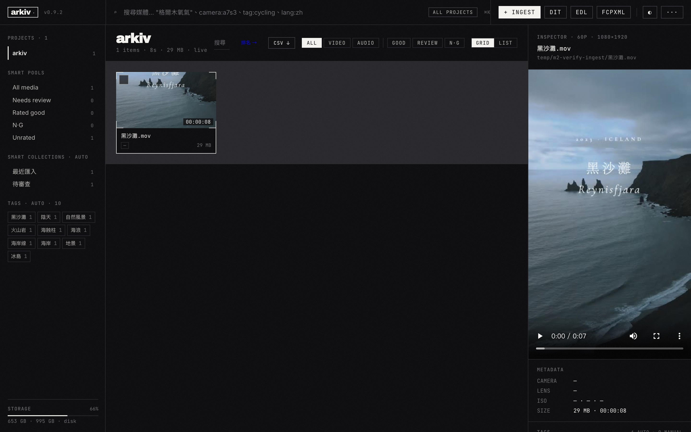

# arkiv

[](LICENSE)
[](https://python.org)
[](https://tauri.app)

**Source-available AI metadata layer for DIT workflows — Resolve-native, CJK-first.**

> 🌐 **English** | [繁體中文](README.zh-TW.md)
>
> 📦 **Just want the app?** → **[https://vulture-s.github.io/arkiv/](https://vulture-s.github.io/arkiv/)** — download, what it does, and the licence in one page.
> Free for any purpose, commercial work included.

arkiv sits between your media drive and DaVinci Resolve: it ingests your footage, attaches AI-generated metadata (transcript, vision tags, atmosphere, energy, edit position), and surfaces clips via semantic search in any language — Chinese, Japanese, or English. The Resolve plugin lets you search, import with clip color, and drop frame markers without leaving the NLE.

Designed for solo DITs and small crews who own their data: local-first, self-hosted, source-available (PolyForm Perimeter), no cloud dependency.

---

## Why arkiv

- **Too much footage, can't find the shot** → search in plain language ("all dusk establishing shots from May"), in Chinese / Japanese / English — it searches what's *in* the frame and the transcript, not filenames.
- **AI editing tools only understand footage with someone talking** → arkiv runs vision analysis + transcription on every clip, so B-roll and dialogue-free footage stay searchable and manageable.
- **Your library has to feed any downstream edit** → manual, automated, or script-driven: native Resolve plugin, EDL / FCPXML export, API / MCP interface.

> **License in one line:** arkiv is free to use for **any** purpose, commercial work included (source-available); what you make with it is **100% yours**. The only thing off-limits is turning arkiv into a product that competes with it.
>
> **Proven at scale:** fully indexed a **1,506-clip real production library** (1,161 of them dialogue-free B-roll) on a single RTX 4070.

## Screenshots



<details>
<summary>System architecture & data flow (for contributors / fork authors)</summary>

### Architecture

```
┌─────────────┐    ┌──────────────┐    ┌─────────────┐
│  index.html │◄──►│  server.py   │◄──►│   db.py      │
│  (Tailwind) │    │  (FastAPI)   │    │  (SQLite)    │
└─────────────┘    └──────┬───────┘    └─────────────┘
                          │
                   ┌──────┴───────┐
                   │  embed.py    │◄──► ChromaDB
                   │  (Ollama)    │     (bge-m3)
                   └──────────────┘

  ═══════════════ Ingest Pipeline (2-Phase) ═══════════════

  Phase 1: Probe + Transcribe + LLM Polish
  ┌───────────┐ ┌─────────────┐ ┌──────────────┐
  │ ingest.py │→│transcribe.py│→│ qwen2.5:14b  │
  │ (FFmpeg)  │ │(Whisper+VAD)│ │ (LLM polish) │
  └───────────┘ └─────────────┘ └──────────────┘
       │              ↑
       │         Silero VAD
       │        (silence filter)
       ▼
  Phase 2: Vision (after unloading LLM from VRAM)
  ┌─────────┐  ┌──────────────┐
  │frames.py│→ │  vision.py   │
  │(extract)│  │(qwen2.5vl:7b) │
  └─────────┘  └──────────────┘
```

→ **Full pipeline (4 stages, storage layout, exit codes, maintenance modes)**: [docs/pipeline.md](docs/pipeline.md) · architecture overview [ARCHITECTURE.md](ARCHITECTURE.md)

</details>

## Features

**Find footage**
- Semantic search (Chinese / English / Japanese) — searches what's *in* the frame and the transcript, not filenames
- Library Chat: compilation search, refine the previous result, find similar shots, analytics — with conversation memory
- Ratings (GOOD / NG / Review) plus auto and manual tags with autocomplete

**AI metadata**
- Whisper large-v3-turbo transcription + a **4-layer anti-hallucination guard** (VAD silence filter → no_speech threshold → blank/repeat filter → LLM correction)
- Frame vision analysis with brand/object recognition; 360 footage (Insta360 / GoPro Max) reprojected before indexing
- Chinese transcripts stored as Taiwan Traditional (plus a batch converter for an existing library)
- Full camera metadata: EXIF + Sony XAVC sidecar, so FX-series footage keeps its identity

**On-set DIT**
- Card offload: parallel multi-destination copy + per-file hash verify + resumable, and it **never deletes the source card**
- ASC MHL v2 hash manifests (interop-verified against the ASC reference implementation)
- Camera report CSV, auto-offload on card insert, browser DIT console (`/dit`)

**Into the edit**
- DaVinci Resolve plugin: search, import with clip color, add frame markers
- Export SRT / VTT / TXT / EDL (DF/NDF) / FCPXML 1.8, plus metadata CSV straight into Resolve
- Web UI, CLI and API all work on the same library

<details>
<summary>Full feature list (including advanced options)</summary>

- **Semantic search** — query in natural language (Chinese/English/Japanese)
- **Chat RAG over your video library** — 5-intent assistant for compilation searches, refinement, similarity, analytics, and general questions with persisted conversation memory
- **AI transcription** — Whisper large-v3-turbo + Silero VAD + LLM polish (Apple Silicon MLX / NVIDIA CUDA)
- **4-layer anti-hallucination guard** — VAD silence filter → no_speech threshold → blank/repeat filter → LLM correction
- **Frame analysis** — qwen2.5vl:7b vision descriptions with brand/object recognition
- **2-phase pipeline** — transcribe first, unload LLM, then vision (avoids VRAM conflict on 12GB GPUs)
- **Rating system** — GOOD / NG / Review with notes + clip color in Resolve
- **Tag system** — auto (AI) + manual tags with autocomplete
- **DaVinci Resolve UI** — dark theme, 3-panel layout, filmstrip, waveform
- **Export** — SRT, VTT, TXT, EDL (drop-frame TC), FCPXML 1.8 (FCPX + DaVinci compatible)
- **DaVinci Resolve metadata CSV** — `/api/export/metadata-csv` endpoint exports clip metadata (Camera/Lens/ISO/Shutter/Aperture/GPS/CreateDate) ready for Resolve's `File → Import Metadata from CSV`. Plugin auto-prompts after import
- **ExifTool integration** — auto-extracts 12 fields per clip (Make/Model/LensModel/GPS/ColorSpace/ISO/Shutter/Aperture/FocalLength/CreateDate). Sidecar-aware for Sony XAVC `.XML`, iPhone Keys group, Blackmagic Cam app per-vendor lens tags. Auto-detects exiftool binary on Windows (winget/scoop/chocolatey/Program Files)
- **EDL reel name** — uses ExifTool ReelName with safe fallback to filename stem (8-char CMX3600 compat, control-char sanitized)
- **HEVC/ProRes browser proxy** — auto-builds H.264 proxy on demand for browser playback
- **Tauri native app** — desktop app with native file/folder dialogs
- **DaVinci Resolve plugin** — search, import with clip color, add frame markers
- **ASC MHL v2 hash manifests** — `mhl.py create` / `verify` CLI emits real `urn:ASC:MHL:v2.0` with `xxh3` / `md5` / `sha1` / `sha256` / `c4`, directory + structure root hashes, chained `ascmhl_chain.xml`. Interop-verified with ASC reference impl 1.2 — drop-in for Silverstack / MediaVerify / Hedge / YoYotta workflows
- **Multi-destination offload** — `offload.py --src <SD> --dst <A> --dst <B>` does chunked parallel copy + per-file hash verify + 3× retry on mismatch + atomic rename + sidecar-aware (XAVC / ARRI / RED / iPhone Live Photo). Resumable JSON state file — kill mid-copy and pending files pick up exactly where they stopped. Emits per-dst MHL v2
- **Camera report CSV** — `camera_report.py` writes 20-col DIT-spec CSV (Reel / TC / Camera / Lens / ISO / Shutter / Aperture / WB / FPS / Codec / ...) for Resolve's `File → Import Metadata from CSV`. Day-summary footer aggregates clip count + runtime by camera / by card
- **DIT Offload UI (`/dit`)** — browser control panel for card→backup offload: preview the destination layout, run with **live per-file progress streaming**, multi-destination + `xxh3` verify + ASC MHL v2. Never deletes the source card
- **Offload organize policy** — `offload.py --organize "{date}/{camera}/{reel}"` files footage into a date/camera/reel tree (tokens: `{date}/{camera}/{reel}/{stem}/{ext}`, fs-safe, path-traversal guarded) — or leave it empty to mirror the source structure
- **Card-watcher** — `offload.py --watch` auto-offloads on card insert (detects DCIM / media volumes), with re-insert / mount-flicker guard so a wobbling card never re-copies
- **360 reprojection** — dual-fisheye `.insv` / `.360` clips are reprojected to **equirectangular** before vision tagging (FFmpeg `v360`), so on-frame text and events the raw fisheye hides become searchable
- **Vision failure tolerance** — `ingest.py --max-failures N` / `--skip-failed` tolerate flaky per-frame vision on long unattended runs; failed frames are left empty for a later `--vision-only` resume (a whole-Ollama outage still halts fast)

</details>

## DaVinci Resolve integration

arkiv isn't just another asset manager sitting beside your NLE — it runs inside it:

- **Resolve plugin** (`resolve_plugin/`): search your arkiv library from within Resolve, import results **with clip color** onto the timeline, and drop frame markers — without leaving the NLE.
- **Ratings carry through**: GOOD / NG / Review become Resolve clip colors.
- **Metadata CSV**: `/api/export/metadata-csv` emits exactly the columns Resolve's `File → Import Metadata from CSV` expects (Camera/Lens/ISO/Shutter/Aperture/GPS/CreateDate); the plugin prompts for it after import.
- **Timeline interchange**: EDL (drop-frame / non-drop timecode) and FCPXML 1.8, compatible with both FCPX and DaVinci.

> On macOS, Resolve needs the official python.org Python 3.10 Framework (see Prerequisites below).

## API / MCP

Everything arkiv does is available over a REST API (`/api/*`, scope-based Bearer tokens)
and a read-only MCP server — the Web UI is just one client. Script it, wire it into an
automation, or let Claude/OpenClaw query your library.

→ **[API auth, token scopes, and the library Chat (RAG) endpoint: docs/api.md](docs/api.md)**

## Quick Start

### Download the app (macOS Apple Silicon · Windows x64)

The quickest way to run arkiv without a Python setup. The installer bundles the Python backend
and ML libraries (torch, whisper, chromadb, …), so you skip the venv/pip steps below. You
**still need FFmpeg and Ollama** for frame extraction, embeddings, and vision.

**macOS (Apple Silicon)**

```bash
brew install ffmpeg ollama
ollama pull bge-m3 && ollama pull qwen2.5vl:7b && ollama pull qwen2.5:14b
```

Download **`arkiv_<version>_aarch64.dmg`** from the [latest release](https://github.com/vulture-s/arkiv/releases/latest), open it, and drag **arkiv** to Applications. On first launch the build is unsigned, so macOS Gatekeeper blocks a double-click — **right-click → Open** once (or run `xattr -dr com.apple.quarantine /Applications/arkiv.app`); afterwards it opens normally. Full walkthrough: [`docs/quickstart-mac.md`](docs/quickstart-mac.md).

**Windows (x64)**

```powershell
winget install Gyan.FFmpeg Ollama.Ollama
ollama pull bge-m3; ollama pull qwen2.5vl:7b; ollama pull qwen2.5:14b
```

Download **`arkiv_<version>_x64-setup.exe`** from the [latest release](https://github.com/vulture-s/arkiv/releases/latest) and run it — it installs per-user, no admin prompt. The build is unsigned, so SmartScreen shows *"Windows protected your PC"* once: click **More info** → **Run anyway**. An `.msi` is also published for admin/GPO deployment. Full walkthrough: [`docs/quickstart-windows.md`](docs/quickstart-windows.md).

On a fresh, empty library both builds load a **pre-indexed** sample of four CC-BY Blender clips, so the grid is browsable and searchable the moment it opens — no pipeline run, no models needed for that first look.

> Intel Macs and Linux have no prebuilt app — run from source instead (below). The macOS bundle ships an `aarch64` Python + `mlx-whisper`; the Windows bundle ships a CPU-only `faster-whisper` stack.

---

Everything below installs and runs arkiv **from source** — for development, or on Linux / Windows.

### Prerequisites

| Dependency | macOS (brew) | Linux (apt) | Windows |
|---|---|---|---|
| Python 3.9+ | `brew install python` | `sudo apt install python3 python3-venv` | [python.org](https://python.org) |
| FFmpeg 6.0+ | `brew install ffmpeg` | `sudo apt install ffmpeg` | [ffmpeg.org](https://ffmpeg.org/download.html) |
| Ollama | `brew install ollama` | [ollama.com/download](https://ollama.com/download) | [ollama.com/download](https://ollama.com/download) |

> **DaVinci Resolve Plugin extra (macOS):** Resolve requires the official Python 3.10 Framework installer (.pkg) from [python.org](https://www.python.org/downloads/release/python-31011/) — Homebrew Python is not recognized. Install path: `/Library/Frameworks/Python.framework/Versions/3.10/`. Restart Resolve after install; Py3 should appear in Console and scripts load via Workspace > Scripts.

### Install — macOS (brew + pip)

```bash
brew install python ffmpeg ollama
git clone https://github.com/vulture-s/arkiv.git
cd arkiv
python3 -m venv .venv && source .venv/bin/activate
pip install -r requirements.txt
pip install mlx-whisper          # Apple Silicon (Metal GPU)
ollama pull bge-m3 && ollama pull qwen2.5vl:7b && ollama pull qwen2.5:14b
python health.py
```

### Install — Linux (pip)

```bash
sudo apt install python3 python3-venv ffmpeg
git clone https://github.com/vulture-s/arkiv.git
cd arkiv
python3 -m venv .venv && source .venv/bin/activate
pip install -r requirements.txt
pip install faster-whisper torch  # NVIDIA CUDA GPU
# pip install faster-whisper      # CPU fallback
ollama pull bge-m3 && ollama pull qwen2.5vl:7b && ollama pull qwen2.5:14b
python health.py
```

### Install — Windows (pip, PowerShell)

```powershell
# Install Python 3.9+, FFmpeg, and Ollama manually first, then:
git clone https://github.com/vulture-s/arkiv.git
cd arkiv
python -m venv .venv
.\.venv\Scripts\activate
pip install -r requirements.txt
pip install faster-whisper torch  # NVIDIA CUDA GPU
# pip install faster-whisper      # CPU fallback
ollama pull bge-m3; ollama pull qwen2.5vl:7b; ollama pull qwen2.5:14b
$env:PYTHONUTF8=1; python health.py
```

### Install — Docker (all platforms)

```bash
git clone https://github.com/vulture-s/arkiv.git
cd arkiv
docker compose up -d
# Open http://localhost:8501
```

> Models are pulled automatically inside the Ollama container on first run (may take a few minutes).

<details>
<summary>Upgrading from an old version (v0.3.0 → v0.3.1 storage layout migration)</summary>

v0.3.1 changed the default storage layout (artifacts now live in `BASE_DIR/.arkiv/`). Only needed when upgrading from before that:

```bash
cd ~/.arkiv && git pull && python ingest.py --migrate-storage
```

Full SOP (backup, rollback, per-project layout): [docs/pipeline.md](docs/pipeline.md) · [CHANGELOG](CHANGELOG.md)

</details>

### Option A: Web UI — browse, search, rate, and tag in the browser

```bash
# macOS / Linux
uvicorn server:app --host 0.0.0.0 --port 8501

# Windows (PowerShell) — UTF-8 required for CJK search
$env:PYTHONUTF8=1; uvicorn server:app --host 0.0.0.0 --port 8501

# Open http://localhost:8501 → click + to ingest media
```

### Option B: CLI only — ingest and search without opening a browser

> Both options use the same database. You can mix and match — ingest via CLI, then browse in Web UI, or vice versa.
>
> **Note:** Do not run CLI and Web UI ingest at the same time. SQLite does not support concurrent writes — run one at a time.

```bash
# Step 1 — Ingest your media
python ingest.py --dir /path/to/media

# Step 2 — Build search index
python embed.py

# Step 3 — Search
python embed.py --search "interview outdoor"
```

<details>
<summary>Advanced CLI options</summary>

```bash
# Ingest options
python ingest.py --dir ./media --limit 10        # process first 10 files only
python ingest.py --dir ./media --skip-vision     # skip AI frame descriptions
python ingest.py --dir ./media --refresh         # re-process already-indexed files (re-extracts frames)
python ingest.py --dir ./media --skip-failed     # tolerate flaky per-frame vision (overnight runs)
python ingest.py --dir ./media --max-failures 20 # halt vision only after 20 cumulative frame failures
python ingest.py --vision-only --dir ./media     # resume: only re-run vision on frames left empty

# Index options
python embed.py --rebuild                    # drop and rebuild from scratch

# DIT offload (card → backup; never deletes source)
python offload.py --src /Volumes/CARD --dst /Volumes/Backup1 --dst /Volumes/Backup2
python offload.py --src /Volumes/CARD --dst /Volumes/Backup --organize "{date}/{camera}/{reel}"
python offload.py --watch --dst /Volumes/Backup # auto-offload on card insert

# Auto-watch a folder for new media (ingest)
python watch.py /path/to/footage
python watch.py ~/Movies/rushes --interval 10

# API search (requires server running)
# Linux / macOS / Git Bash
curl "http://localhost:8501/api/media?q=keyword&limit=5"
# Windows PowerShell
Invoke-RestMethod "http://localhost:8501/api/media?q=keyword&limit=5"
```

</details>


## Configuration

<details>
<summary>All environment variables (`.env`) — defaults just work; open this to tune</summary>

Copy `.env.example` to `.env` and customize:

| Variable | Default | Description |
|----------|---------|-------------|
| `ARKIV_DB_PATH` | `./media.db` | SQLite database path |
| `ARKIV_CHROMA_PATH` | `./chroma_db` | ChromaDB vector store |
| `ARKIV_THUMBNAILS_DIR` | `./thumbnails` | Thumbnail output dir |
| `ARKIV_OLLAMA_URL` | `http://localhost:11434` | Ollama API endpoint |
| `ARKIV_EMBED_MODEL` | `bge-m3` | Embedding model — **do not change after indexing** (see note below) |
| `ARKIV_VISION_MODEL` | `qwen2.5vl:7b` | Vision model for frame descriptions. **2.5-VL is the deliberate default over qwen3-vl:8b**: Qwen3-VL's vision path is ~10× slower under Ollama (measured ~60s/frame vs ~8s/frame) — 30h vs 3.5h across 2000 frames, at comparable tag quality. Set `ARKIV_OLLAMA_VISION_MODEL=qwen3-vl:8b` for the higher ceiling |
| `ARKIV_CHAT_MODEL` | `qwen2.5:14b` | Chat model — answers and (by default) intent classification |
| `ARKIV_INTENT_MODEL` | *(= `ARKIV_CHAT_MODEL`)* | Optional faster model for intent classification only; must be installed |
| `ARKIV_WHISPER_MODEL` | `mlx-community/whisper-large-v3-turbo` (macOS) / `large-v3-turbo` (other) | Whisper model |
| `ARKIV_CUSTOM_VOCABULARY` | *(empty)* | Comma-separated hotwords (names/jargon) fed to Whisper's `initial_prompt` |
| `ARKIV_VOCABULARY_FILE` | *(empty → `.arkiv/vocabulary.txt` if present)* | Newline-delimited hotword file (one term/line, `#` comments); merged with the above |
| `ARKIV_EXIFTOOL_PATH` | *(empty — auto-detect)* | Path to exiftool binary (optional) |
| `ARKIV_FFMPEG_PATH` | *(empty — auto-detect)* | Path to ffmpeg binary (optional; set on headless Windows where only a WinGet alias shim is on PATH) |
| `ARKIV_FFPROBE_PATH` | *(empty — auto-detect)* | Path to ffprobe binary (optional; same as above) |
| `ARKIV_HOST` | `0.0.0.0` | Server bind address |
| `ARKIV_PORT` | `8501` | Server port |

> **Embedding model is locked to your index.** The vector store is built with one embedding model (`bge-m3`, 1024-dim). Changing `ARKIV_EMBED_MODEL` after you have indexed media makes new query vectors incompatible with stored ones — search results degrade silently. To switch models, re-index from scratch.
>
> **Hardware floor for chat:** `qwen2.5:14b` needs ~9 GB and runs alongside the embedding model. Plan for ~12–16 GB free RAM/VRAM on the Ollama host. On tighter machines, set `ARKIV_CHAT_MODEL=qwen2.5:7b` (~4.7 GB) for a lighter default.

</details>

## Tech Stack

| Layer | Technology |
|-------|-----------|
| Frontend | Tailwind CSS + vanilla JS |
| Backend | FastAPI + Uvicorn |
| Database | SQLite (metadata) + ChromaDB (vectors) |
| Embedding | Ollama bge-m3 (1024d, cosine) |
| Transcription | mlx-whisper / faster-whisper (large-v3-turbo) |
| VAD | Silero VAD (silence filter before Whisper) |
| LLM Polish + Chat | Ollama qwen2.5:14b (transcript polish + 5-intent chat RAG) |
| Vision | Ollama qwen2.5vl:7b (brand/object recognition) |
| Media | FFmpeg (probe, thumbnails, frame extraction) |
| Metadata | ExifTool (12 fields, sidecar-aware, cross-platform auto-detect) |
| Export | SRT, VTT, TXT, EDL (DF/NDF), FCPXML 1.8 |
| Desktop | Tauri (native app wrapper) |
| NLE Plugin | DaVinci Resolve (import + clip color + markers) |

## FAQ

**Q: Which Whisper backend should I use?**
- macOS with Apple Silicon: `mlx-whisper` (fastest, uses Metal GPU)
- NVIDIA GPU: `faster-whisper` + `torch` (CUDA acceleration)
- CPU only: `faster-whisper` (slower but works everywhere)

**Q: Do I need Ollama running?**
Yes, for semantic search (embedding) and optional frame descriptions. Run `ollama serve` before starting arkiv.

**Q: How do I add media?**
Use the `+` button in the Media Pool sidebar, or run `python ingest.py --dir /path/to/media` from CLI.

**Q: Can I use this without Docker?**
Yes — the native Python install is the primary workflow. Docker is optional for deployment.

**Q: What file formats are supported?**
Video: `.mp4`, `.mov`, `.mkv`, `.avi`, `.webm`, `.m4v`, `.mts`, `.mxf` (Sony FX6/FX9/Venice XAVC)
360: `.insv` (Insta360), `.360` (GoPro Max) — dual-fisheye is reprojected to equirectangular before vision tagging (single-lens 360 footage is indexed as-is)
Audio: `.wav`, `.mp3`, `.m4a`, `.aac`, `.flac`, `.ogg`
Camera metadata (make/model/lens/timecode) is read from embedded EXIF **and** Sony XAVC NRT sidecar XML — so FX30/FX-series footage keeps its identity.

## Smoke Test

Run the built-in smoke test to verify your setup:

```bash
# PC (Windows/macOS)
bash smoke-test.sh --platform pc

# Docker
docker exec arkiv-arkiv-1 bash smoke-test.sh --platform docker
```

The test has two phases: **Health Check** (environment) and **API Smoke Test** (server endpoints).

### What SKIP means

SKIP items are **optional dependencies** — they do not affect functionality. A passing result is **0 FAIL**, regardless of SKIP count.

| Check | PC (Windows) | PC (macOS) | Docker | Notes |
|-------|:---:|:---:|:---:|-------|
| Python >= 3.9 | Required | Required | Required | |
| FFmpeg / ffprobe | Required | Required | Required | |
| Ollama server | Required | Required | Required | |
| bge-m3 | Required | Required | Required | |
| qwen2.5vl:7b | Optional | Optional | Optional | For frame descriptions |
| qwen2.5:14b | Optional | Optional | Optional | Transcript polish + chat (required for `/api/chat`) |
| ExifTool | Optional | Optional | Optional | For rich metadata |
| faster-whisper | Required | Optional | Required | CUDA/CPU whisper |
| mlx-whisper | — | Required | — | Apple Silicon only |
| NVIDIA GPU | Optional | — | — | |
| Apple Silicon | — | Required | — | |
| fastapi + uvicorn | Required | Required | Required | |

### Latest Results

| Platform | Health Check | Smoke Test | Date |
|----------|-------------|------------|------|
| Windows 11 (RTX 4070) | 19/19 PASS, 0 FAIL, 0 SKIP | 9/9 PASS | 2026-05-22 |
| Linux (Docker) | 14/17 PASS, 0 FAIL, 3 SKIP | 9/9 PASS | 2026-05-22 |

## For developers

[ARCHITECTURE.md](ARCHITECTURE.md) (architecture overview) · [docs/api.md](docs/api.md) (API + Chat) · [docs/pipeline.md](docs/pipeline.md) (full pipeline) · [CONTRIBUTING.md](CONTRIBUTING.md) · [CHANGELOG.md](CHANGELOG.md)

## License

PolyForm Perimeter License 1.0.1 — see [LICENSE](LICENSE).

Using arkiv is free for **any** purpose, commercial work included: paid client jobs, studio use, funded productions. Videos, timelines and exports you produce with it are yours, with no restriction from the license. The one thing that is not permitted is providing others with a product that competes with arkiv — forking it into a rival asset manager, wrapping it as a hosted indexing service sold to third parties, or reimplementing its functionality as a substitute product, including free of charge.

The line is what your customer is buying: a deliverable you produced with arkiv is ordinary tool use; arkiv's functionality itself, sold as a product or service, competes.

## Pro add-on

The free core covers up to **3 projects**. The optional **Pro add-on** — a separate closed-source component — unlocks unlimited projects and cross-project aggregation (search and collections spanning projects) for **NT$3,000, one time, perpetual**. No subscription, no activation server, no phone-home. Terms: [docs/pro-addon-license.md](docs/pro-addon-license.md).

> Not yet on sale — the purchase path is still being built. The terms page is published so you can read them before that happens.

## Public-Interest Program

arkiv is free to use for any purpose, so public-interest work needs no permission from us to use the core. What the program grants is the **Pro add-on, free and perpetual**, for work that serves the public interest:

- Public-issue documentaries
- Nonprofit / public-good visual work
- Local memory, oral history, and archival preservation
- Public education and public media

The knowledge layer over footage shouldn't be something only big productions can afford.

**How to apply:** open a [GitHub Issue](https://github.com/vulture-s/arkiv/issues) with `[public-interest]` in the title, or DM [@vulture.s](https://www.instagram.com/vulture.s/) on Instagram, with a short description of your project. Reviewed case by case — no automatic eligibility checklist. See [PUBLIC-INTEREST.md](PUBLIC-INTEREST.md) for examples, a sample request, and the case-by-case discretion statement.

## Contact & Follow

- Dev log and demos: Threads / Instagram [@vulture.s](https://www.instagram.com/vulture.s/)
- Bug reports and feature requests: [GitHub Issues](https://github.com/vulture-s/arkiv/issues)
- Commercial partnership / deployment help: DM on IG, or open an Issue with `[biz]` in the title
